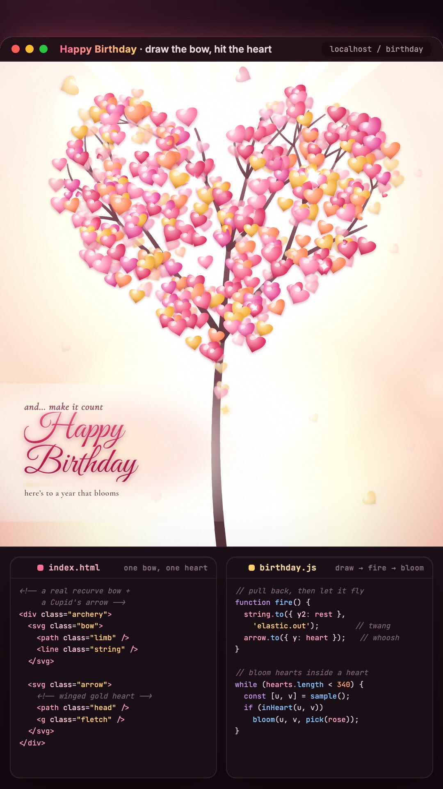

# Happy Birthday 🏹💗🌳

A birthday film in four acts, in the browser. Draw a real recurve bow, send a
Cupid's arrow into a beating heart, and watch it burst and bloom into a **tree of
hearts** under a hand-lettered wish.

No framework, no video file — it's vanilla JavaScript, one `<canvas>`, and GSAP
for the choreography.



▶️ **[media/demo-silent.mp4](media/demo-silent.mp4)** — a short silent capture of the whole film.

---

## The four acts

1. **The invitation** — a softly *beating* heart on a warm field, with a small
   recurve bow nocked below it. Pull the string back and release.
2. **The shot** — the string snaps (a real elastic twang), the arrow flies on a
   diagonal and **embeds in the heart**, which bursts into a flood of rose.
3. **The wish** — kinetic type hinges up out of that colour, glyph by glyph:
   *HAPPY / BIRTHDAY*, under cinema bars and a slow camera push.
4. **The tree** — a gold light blooms, and a bare tree grows and fills a
   heart-shaped canopy with hundreds of lit blossoms, petals drifting down, the
   Great Vibes wish writing itself on.

It's built to be **interactive**: pull the bow with the mouse or a touch drag,
or focus it and press <kbd>Enter</kbd> / <kbd>Space</kbd>.

## Run it

```bash
npm install
npm run dev        # open the printed localhost URL
```

```bash
npm run build      # production build → dist/
npm run preview    # serve the built dist/
```

## How it's made

- **One GSAP master timeline** runs acts 1–3 (the draw, the shot, the flood, the
  kinetic wish). It's rebuilt from measured geometry on every play, so the arrow
  always lands dead-centre on the heart at any viewport size or shot angle.
- **One `<canvas>` engine** runs act 4 (the tree). Every blossom, bokeh orb and
  sparkle is rendered **once** to an offscreen sprite; the animation only moves
  transforms and alpha, so hundreds of hearts stay smooth on one `rAF` loop.
- **The bow** is a live SVG — wooden limbs, a leather grip, and a two-segment
  string whose nock is animated as you draw. The arrow is a winged golden
  heart-tip with rose-red feather fletching.
- Only `transform` and `opacity` are animated on the DOM; GSAP owns every
  transform. A grain + vignette lens sits over the whole piece.
- **Accessible**: the bow is a real focusable control with a keyboard path, and
  `prefers-reduced-motion` skips the film and shows the finished tree + wish.

## Stack

Vanilla JS · [GSAP](https://gsap.com/) · Canvas 2D · [Vite](https://vitejs.dev/) ·
Google Fonts (Great Vibes, Fraunces, Cormorant Garamond)

## License

[MIT](LICENSE) © Hasib

_The silent demo has no audio; the soundtrack in the published Short uses a
third-party music track and is not included here._
